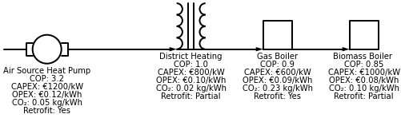
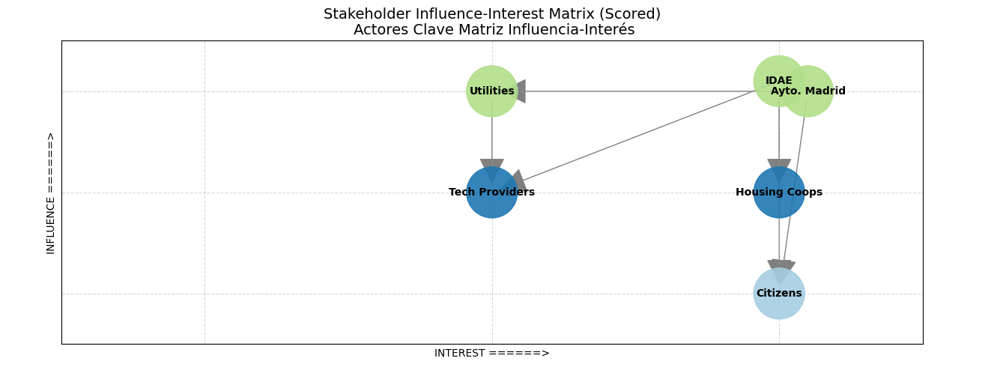

<table>
  <tr>
    <td></td>
    <td><h1>Low-Carbon Heating Roadmap for Madrid</h1></td>
  </tr>
</table>

General Objective:
---
Design a practical roadmap to evaluate how Madrid can adopt low-carbon heating systems, aligning technology rollout with mid-term policies, business goals, and investment priorities.

Specific Objectives:
1. Identify priority zones: Analyze historical emissions using public datasets and apply Pareto analysis to find the top 20% of districts responsible for 80% of heating-related emissions. Prioritize zones based on emissions intensity and socio-economic vulnerability.

2. Model technology adoption: Forecast adoption trends for heat pumps, district heating, gas boilers, and biomass boilers using predictive analytics and stochastic optimization — inspired by Toyota Production System and Six Sigma principles.

3. Build an interactive dashboard: Develop a Streamlit to visualize emissions hotspots, simulate technology rollout, and present cost-benefit tradeoffs in € and % of emissions gap closed by 2030 — tailored for policymakers, citizens, and retrofit planners.

4. Stakeholder analysis: Identify key actors, their influence, and decision levers in heating decarbonization with dashboard filters to simulate scenarios (e.g. “What if IDAE increases subsidies for heat pumps in Centro and Usera, while district heating expands in Tetuán?”).

   
---

## Table of Contents

1. [Repo Structure](#repo-structure)  
2. [Quick Start](#quick-start)  
3. [Data Sources](#data-sources)  

---

## Repo Structure

```
├── .gitignore
├── README.md
├── app.py
├── assets/
│   ├── ayunta.madrid.png
│   ├── co2.png
│   ├── density.png
│   ├── df.csv
│   ├── emissions_map.png
│   ├── heating_technologies_diagram.png
│   ├── income.png
│   ├── logreg_tuned_model.pkl
│   ├── madrid_districts.geojson
│   ├── optimization_problem.png
│   ├── pareto.png
│   ├── sql_entity_relationship_diagram.png
│   ├── sql_entity_relationship_model.png
│   ├── stakeholders.png
│   └── tech_district_stats.csv
├── config.yml
├── data/
│   ├── ingest_audit/
│   │   ├── audit_atm_inventario_gei_20251029_213554.json
│   │   ├── audit_emision-de-contaminantes-atmosfericos-por-sectores-particulas-en-suspension-pst_20251029_215558.json
│   │   └── audit_registro_certificados_eficiencia_energetica_2025_20251029_213722.json
│   ├── processed/
│   │   ├── df_ceee.csv
│   │   ├── df_gei.csv
│   │   ├── df_pst.csv
│   │   ├── heating_technologies.csv
│   │   ├── sql_buildings_train.csv
│   │   ├── sql_query_pareto_flag.csv
│   │   └── stakeholder_map.csv
│   └── raw/
│       ├── Distritos/
│       │   ├── DISTRITOS.cpg
│       │   ├── DISTRITOS.dbf
│       │   ├── DISTRITOS.prj
│       │   ├── DISTRITOS.sbn
│       │   ├── DISTRITOS.sbx
│       │   ├── DISTRITOS.shp
│       │   ├── DISTRITOS.shp.xml
│       │   └── DISTRITOS.shx
│       ├── heating_technologies.csv
│       ├── postal_to_district.csv
│       ├── renta_media_madrid.csv
│       └── stakeholder_map.csv
├── notebooks/
│   ├── 01_collection_wrangling_gei.ipynb
│   ├── 02_collection_wrangling_pst.ipynb
│   ├── 03_collection_wrangling_ceee.ipynb
│   ├── 04_eda.ipynb
│   ├── 05_emissions_pareto.ipynb
│   ├── 06_adoption_modeling.ipynb
├── requirements.txt
├── sql/
│   ├── 01_join_districts.sql
│   └── 02_buildings_train.sql
└── src/
    ├── __init__.py
    ├── __pycache__/
    │   ├── __init__.cpython-313.pyc
    │   ├── cleaning.cpython-313.pyc
    │   ├── features.cpython-313.pyc
    │   ├── io.cpython-313.pyc
    │   ├── load_config.cpython-313.pyc
    │   ├── load_data.cpython-313.pyc
    │   └── loader.cpython-313.pyc
    ├── cleaning.py
    ├── features.py
    ├── io.py
    └── loader.py
```
---
## Quick Start

1. **Clone the repository w/ terminal**:

```bash
git clone https://github.com/MBengochea/Low-Carbon-Heating-Roadmap-for-Madrid.git
```

2. **Install UV if you dont have it**

If you're a MacOS/Linux user type:

```bash
curl -LsSf https://astral.sh/uv/install.sh | sh
```

If you're a Windows user open an Anaconda Powershell Prompt and type :

```bash
powershell -ExecutionPolicy ByPass -c "irm https://astral.sh/uv/install.ps1 | iex"
```

3. **If you have UV, create an environment**

```bash
uv venv 
```

4. **Activate the environment**

If you're a MacOS/Linux user type (if you're using a bash shell):

```bash
source ./venv/bin/activate
```

If you're a MacOS/Linux user type (if you're using a csh/tcsh shell):

```bash
source ./venv/bin/activate.csh
```

If you're a Windows user type:

```bash
.venv\Scripts\activate
```

5. **Install dependencies**:

```bash
uv pip install -r requirements.txt
```
---
## **Data Sources**

1. **Greenhouse Gas Emissions Inventory – Comunidad de Madrid**  
[Dataset link](https://datos.comunidad.madrid/dataset/atm_inventario_gei) Provides sectoral greenhouse gas emissions data across the region from 1990 onward. Useful for identifying high-emission zones and quantifying heating-related emissions for Pareto analysis.  
- df_gei Shape: `(5885 rows, 6 columns)`
<details>
<summary> Click here to expand GEI column dictionary / Diccionario de columnas GEI</summary>

| Column name                     | Type    | Meaning (EN)                                      | Significado (ES)                                      |
|--------------------------------|---------|--------------------------------------------------|--------------------------------------------------------|
| `inventario_gei_año`           | int     | Reference Year                                   | Año de referencia                                     |
| `inventario_gei_sector_crf`    | object  | CRF sector                                       | Sector CRF desde el que se emite el contaminante      |
| `inventario_gei_categoria_crf` | object  | CRF category                                     | Categoría CRF desde la que se emite el contaminante   |
| `inventario_gei_actividad_crf` | object  | CRF activity                                     | Actividad CRF desde la que se emite el contaminante   |
| `inventario_gei_contaminante`  | object  | Greenhouse gas type                              | Tipo de gas de efecto invernadero                     |
| `inventario_gei_gg_co2_eq`     | object  | Emissions in CO₂ equivalent (Gg CO₂-eq)          | Emisiones en Gg equivalentes de CO₂                   |
</details>

<hr>

2. **Emissions by Sector – Particulate Matter (PST)**  
[Dataset link](https://datos.comunidad.madrid/dataset/1911600)  Breaks down emissions by activity and pollutant type. → Supports air quality validation and helps correlate heating sources with pollution hotspots.
- df_pst Shape: `(264 rows, 7 columns)`
<details>
<summary> Click here to expand PST column dictionary / Diccionario de columnas PST</summary>
  
| Column name           | Type     | Description (EN)                                                | Descripción (ES)                                           |
|-----------------------|----------|------------------------------------------------------------------|-------------------------------------------------------------|
| `año`                 | int      | Reference year                                                   | Año de referencia                                           |
| `concepto`            | object   | Emission concept (activity + pollutant type)                    | Concepto de emisión (actividad + tipo de contaminante)      |
| `tipo_territorio`     | object   | Territory type (e.g., municipality, region)                     | Tipo de territorio (municipio, región, etc.)                |
| `código_territorio`   | float    | Territory code (may be missing)                                 | Código del territorio (puede faltar)                        |
| `territorio`          | float    | Territory name (may be missing)                                 | Nombre del territorio (puede faltar)                        |
| `valor`               | int      | Emission value in metric tons                                   | Valor de emisión en toneladas métricas                      |
| `estado_dato`         | float    | Data status (e.g., estimated, validated; often missing)         | Estado del dato (estimado, validado; frecuentemente nulo)   |
</details>

<hr>

3. **Energy Efficiency Certificates – Buildings**  
[Dataset link](https://datos.comunidad.madrid/catalogo/dataset/registro_certificados_eficiencia_energetica)  
Contains energy ratings for buildings.  
→ Filter by “Madrid” and join with district shapefiles to estimate heating demand.
- df_ceee Shape: `(115196 rows, 86 columns)` cleaned to `(55717 rows, 17 columns)`
<details>
<summary> Click here to expand CEEE column dictionary / Diccionario de columnas CEEE</summary>
  
| Column Selection | English meaning | Spanish meaning | Units | Why Keep |
|---|---|---|---:|---|
| edif_codpost | Postal code | Código postal | string(5) | Validate district membership and spatial joins |
| edif_fecha | Certificate date | Fecha de emisión | datetime | Time dimension for trends and eligibility |
| edif_año | Year built | Año de construcción | int | Building vintage for retrofit readiness |
| edif_superf | Habitable surface | Superficie habitable | m2 | Normalize metrics and scale interventions |
| edif_compac | Compactness | Compacticidad vol/sup | m3/m2 | Proxy for envelope losses and retrofit impact |
| edif_calef | % area heated | % superficie con calefacción | % | Identify heated stock to target interventions |
| calefac_tipo | Heating type | Tipo de calefacción | category | Core tech classification for replacement scenarios |
| calefac_vector | Heating vector | Vector energético calefacción | category | Fuel mix to model decarbonization pathway |
| elec_demcalef | Heating demand (DB-HE) | Demanda calefacción (DB-HE) | kWh/m2·a | Baseline heating load for Pareto and sizing |
| final_calef | Final energy heating | Consumo final calefacción | kWh/m2·a | Direct mapping to heating energy use |
| norenov_calef | Non-renewable heating energy | Energía no renovable calefacción | kWh/m2·a | Fossil heating baseline for emissions modelling |
| norenov_co2calef | CO2 heating | Emisiones CO2 calefacción | kg CO2/m2·a | Primary outcome metric for heating emissions |
| acs_tipo | Hot-water type | Tipo de ACS | category | ACS decarbonization route and sizing |
| elec_demacs | ACS demand (DB-HE) | Demanda ACS (DB-HE) | kWh/m2·a | ACS sizing and emissions attribution |
| cal_calefdem | Heating demand rating | Calificación demanda calefacción (A–F) | grade | Quick filter to prioritise worst performers |
| cal_norenovglobal | Non-renewable rating global | Calificación energía no renovable (A–F) | grade | Flag poor stock for district prioritisation |
| cal_co2global | CO2 rating global | Calificación emisiones CO2 (A–F) | grade | Communicable KPI for stakeholders |
</details>

<hr>

4. **Real-Time Air Quality – Madrid**  
[Dataset link](https://ciudadesabiertas.madrid.es/dynamicAPI/API/query/calair_tiemporeal.json?pageSize=5000) Live pollution data by station.  
→ Use to validate the impact of heating interventions on air quality and correlate with emissions zones.

- df_air_realtime Shape:  `(126 rows, 56 columns)`
<details>
<summary> Click here to expand AIR_REALTIME column dictionary / Diccionario de columnas AIR_REALTIME</summary>

| Field            | English Description                                      | Descripción en Español                                      |
|------------------|----------------------------------------------------------|--------------------------------------------------------------|
| `provincia`      | Province code (always 28 for Madrid)                     | Código de provincia (siempre 28 para Madrid)                 |
| `municipio`      | Municipality code (always 079 for Madrid city)           | Código del municipio (siempre 079 para Madrid capital)       |
| `estacion`       | Station code (e.g., 004 = Plaza de España)               | Código de estación (ej. 004 = Plaza de España)               |
| `magnitud`       | Pollutant code (e.g., 08 = NO₂, 10 = PM10)               | Código de contaminante (ej. 08 = NO₂, 10 = PM10)             |
| `punto_muestreo` | Sampling point ID: province + municipality + station + pollutant + technique | ID del punto de muestreo: provincia + municipio + estación + magnitud + técnica |
| `ano`            | Year of measurement (4 digits)                           | Año de medición (4 cifras)                                   |
| `mes`            | Month (1–12)                                             | Mes (1–12)                                                   |
| `dia`            | Day of month (1–31)                                      | Día del mes (1–31)                                           |
| `h01`–`h24`      | Hourly value of pollutant (e.g., µg/m³ or mg/m³)         | Valor horario del contaminante (ej. µg/m³ o mg/m³)           |
| `v01`–`v24`      | Validation code for each hour (see below)                | Código de validación por hora (ver abajo)                    |

## Validation Codes (`vXX`)

| Code | English Meaning               | Significado en Español                  |
|------|-------------------------------|------------------------------------------|
| `V`  | Validated                     | Validado                                 |
| `N`  | Not valid                     | No válido                                |
| `P`  | Pending validation            | Pendiente de validación                  |
| `F`  | Missing data                  | Falta de datos                           |
| `S`  | Substituted (estimated)       | Sustituido por estimación                |

## Common Pollutant Codes (`magnitud`)

| Code | Pollutant (EN)               | Contaminante (ES)             | Unit        |
|------|------------------------------|-------------------------------|-------------|
| 01   | Sulfur Dioxide (SO₂)         | Dióxido de Azufre (SO₂)       | µg/m³       |
| 06   | Carbon Monoxide (CO)         | Monóxido de Carbono (CO)      | mg/m³       |
| 07   | Nitric Oxide (NO)            | Monóxido de Nitrógeno (NO)    | µg/m³       |
| 08   | Nitrogen Dioxide (NO₂)       | Dióxido de Nitrógeno (NO₂)    | µg/m³       |
| 09   | PM2.5                        | Partículas < 2.5 µm (PM2.5)    | µg/m³       |
| 10   | PM10                         | Partículas < 10 µm (PM10)      | µg/m³       |
| 12   | Nitrogen Oxides (NOx)        | Óxidos de Nitrógeno (NOx)     | µg/m³       |
| 14   | Ozone (O₃)                   | Ozono (O₃)                     | µg/m³       |
| 20   | Toluene                      | Tolueno                        | µg/m³       |
| 30   | Benzene                      | Benceno                        | µg/m³       |
| 42   | Total Hydrocarbons (Hexane) | Hidrocarburos totales (hexano)| mg/m³       |
| 43   | Methane (CH₄)               | Metano (CH₄)                   | mg/m³       |
| 44   | Non-methane Hydrocarbons    | Hidrocarburos no metánicos    | mg/m³       |

</details>
<hr>

5. **District-Level Shapefiles – Geoportal Madrid**  
[Dataset link](https://geoportal.madrid.es/IDEAM_WBGEOPORTAL/descargasDisponibles.iam?fileIdent=aebec21d-5cad-11f0-9f8c-9009dfd270e9)  
Provides official district boundaries.  
→ Essential for spatial joins and mapping emissions, heating demand, and retrofit scenarios by district.
<hr>

6. **Heating Technology Specs – Spain (IDAE, Eurostat, JRC, REE)**  
`data/tech_specs/heating_technologies.csv`  
Contains real-world cost, efficiency, and emissions data for four key heating technologies in Spain: air-source heat pumps, district heating, gas boilers, and biomass boilers.  
→ Used for scenario modeling, cost-benefit analysis, and emissions gap closure simulations.  

(done with python schemdraw>=0.15)

Sources include:
- [IDAE Air-Source Heat Pump Methodology Spain](https://www.idae.es/sites/default/files/estudios_informes_y_estadisticas/Metodologia_IDAE_reporte_ahorros_art-8_DEE_Bombas_de_calor.pdf)
- [Euroheat District Heating Market Outlook 2025](https://www.euroheat.org/data-insights/outlooks/dhc-market-outlook-2025)
- [Eurostat Energy Balances – Gas Boilers Spain](https://ec.europa.eu/eurostat/web/energy/data/energy-balances)
- [REE National Statistical Series- Biomass Boilers Spain](https://www.ree.es/en/datos/publications/national-statistical-series)
<hr>

7. **Avg. Income per postal Code – Spain (Agencia Tributaria)**  
`data/stakeholders/renta_media_madrid.csv` [Source](https://sede.agenciatributaria.gob.es/AEAT/Contenidos_Comunes/La_Agencia_Tributaria/Estadisticas/Publicaciones/sites/irpfCodPostal/2023/home.html)
<hr>

12. **Stakeholder Map**

