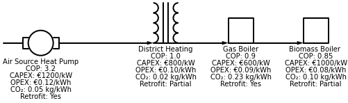
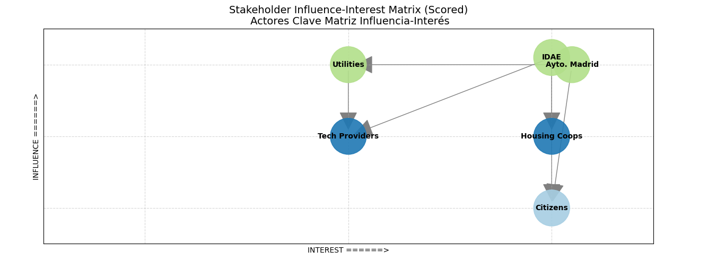

[](https://mbengochea-low-carbon-heating-roadmap-for-madrid-app-nahom1.streamlit.app/)
[](https://nbviewer.jupyter.org/github/MBengochea/Low-Carbon-Heating-Roadmap-for-Madrid/tree/main/)
[](https://mybinder.org/v2/gh/MBengochea/Low-Carbon-Heating-Roadmap-for-Madrid/main?urlpath=lab/tree/notebooks)

<table>
  <tr>
    <td></td>
    <td><h1>Low-Carbon Heating Roadmap for Madrid</h1></td>
  </tr>
</table>

General Objective:
---
Develop a reproducible roadmap that prioritizes low‑carbon heating actions for Madrid using open data, SQL Pareto analysis, machine learning, and budget optimization to produce decision‑ready scenarios.

Specific objectives: 
1) Publish cleaned datasets and ingestion scripts.
2) Use Pareto SQL queries to identify top-impact areas.
3) Use ML to flag retrofit-ready buildings and report model performance.
4) Run budget-constrained optimizations to maximize emissions abatement across scenarios.
5) Ship an interactive Streamlit dashboard for stakeholders.
   
---

## Table of Contents

1. [Repo Structure](#repo-structure)  
2. [Quick Start](#quick-start)  
3. [Data Sources](#data-sources)  

---

## Repo Structure

```
├── .gitignore
├── README.md
├── app.py
├── assets/
│   ├── logreg_tuned_model.pkl
│   ├── madrid_districts.geojson
├── config.yml
├── data/
│   ├── ingest_audit/
│   │   ├── audit_atm_inventario_gei_20251029_213554.json
│   │   ├── audit_emision-de-contaminantes-atmosfericos-por-sectores-particulas-en-suspension-pst_20251029_215558.json
│   │   └── audit_registro_certificados_eficiencia_energetica_2025_20251029_213722.json
│   ├── processed/
│   │   ├── df_ceee.csv
│   │   ├── df_gei.csv
│   │   ├── df_pst.csv
│   │   ├── heating_technologies.csv
│   │   ├── sql_buildings_train.csv
│   │   ├── sql_query_pareto_flag.csv
│   │   └── stakeholder_map.csv
│   └── raw/
│       ├── Distritos/
│       │   ├── DISTRITOS.cpg
│       │   ├── DISTRITOS.dbf
│       │   ├── DISTRITOS.prj
│       │   ├── DISTRITOS.sbn
│       │   ├── DISTRITOS.sbx
│       │   ├── DISTRITOS.shp
│       │   ├── DISTRITOS.shp.xml
│       │   └── DISTRITOS.shx
│       ├── heating_technologies.csv
│       ├── postal_to_district.csv
│       ├── renta_media_madrid.csv
│       └── stakeholder_map.csv
├── notebooks/
│   ├── 01_collection_wrangling_gei.ipynb
│   ├── 02_collection_wrangling_pst.ipynb
│   ├── 03_collection_wrangling_ceee.ipynb
│   ├── 04_eda.ipynb
│   ├── 05_emissions_pareto.ipynb
│   └── 06_adoption_modeling.ipynb
├── requirements.txt
├── sql/
│   ├── 01_join_districts.sql
│   └── 02_buildings_train.sql
└── src/
    ├── __init__.py
    ├── cleaning.py
    ├── features.py
    ├── io.py
    └── loader.py
```
---
## Quick Start

1. **Clone the repository w/ terminal**:

```bash
git clone https://github.com/MBengochea/Low-Carbon-Heating-Roadmap-for-Madrid.git
```

2. **Install UV if you dont have it**

If you're a MacOS/Linux user type:

```bash
curl -LsSf https://astral.sh/uv/install.sh | sh
```

If you're a Windows user open an Anaconda Powershell Prompt and type :

```bash
powershell -ExecutionPolicy ByPass -c "irm https://astral.sh/uv/install.ps1 | iex"
```

3. **If you have UV, create an environment**

```bash
uv venv 
```

4. **Activate the environment**

If you're a MacOS/Linux user type (if you're using a bash shell):

```bash
source ./venv/bin/activate
```

If you're a MacOS/Linux user type (if you're using a csh/tcsh shell):

```bash
source ./venv/bin/activate.csh
```

If you're a Windows user type:

```bash
.venv\Scripts\activate
```

5. **Install dependencies**:

```bash
uv pip install -r requirements.txt
```
---
## **Data Sources (audit json's of cleanings in data/ingest_audit)**

1. **Greenhouse Gas Emissions Inventory – Comunidad de Madrid**  
[Dataset link](https://datos.comunidad.madrid/dataset/atm_inventario_gei) Provides sectoral greenhouse gas emissions data across the region from 1990 onward.
- df_gei Shape: `(5885 rows, 6 columns)`
<details>
<summary> Click here to expand GEI column dictionary</summary>

| Column name                     | Type    | Meaning                                       | 
|--------------------------------|---------|--------------------------------------------------|
| `inventario_gei_año`           | int     | Reference Year                                   | 
| `inventario_gei_sector_crf`    | object  | CRF sector emmiting the gas                      | 
| `inventario_gei_categoria_crf` | object  | CRF category emmiting                            | 
| `inventario_gei_actividad_crf` | object  | CRF activity emmiting                            | 
| `inventario_gei_contaminante`  | object  | Greenhouse gas type                              |
| `inventario_gei_gg_co2_eq`     | object  | Emissions in CO₂ equivalent (Gg CO₂-eq)          |
</details>

<hr>

2. **Emissions by Sector – Particulate Matter (PST)**  
[Dataset link](https://datos.comunidad.madrid/dataset/1911600)  Breaks down emissions by activity and pollutant type.
- df_pst Shape: `(264 rows, 7 columns)`
<details>
<summary> Click here to expand PST column dictionary </summary>
  
| Column name           | Type     | Description                                          |
|-----------------------|----------|------------------------------------------------------------------|
| `año`                 | int      | Reference year                                                   | 
| `concepto`            | object   | Emission concept (activity + pollutant type)                    | 
| `tipo_territorio`     | object   | Territory type (e.g., municipality, region)                     | 
| `código_territorio`   | float    | Territory code (may be missing)                                 | 
| `territorio`          | float    | Territory name (may be missing)                                 |
| `valor`               | int      | Emission value in metric tons                                   | 
| `estado_dato`         | float    | Data status (e.g., estimated, validated; often missing)         | 
</details>

<hr>

3. **Energy Efficiency Certificates – Buildings**  
[Dataset link](https://datos.comunidad.madrid/catalogo/dataset/registro_certificados_eficiencia_energetica)  
Contains energy ratings for buildings. Filtered by “Madrid postal codes” and join with district shapefiles to estimate heating demand.
- df_ceee Shape: `(115196 rows, 86 columns)` cleaned to `(55717 rows, 17 columns)`
<details>
<summary> Click here to expand CEEE column dictionary</summary>
  
| Column Selection | meaning | Units | Why Keep |
|---|---|---|---:|---|
| edif_codpost | Postal code | string(5) | Validate district membership and spatial joins |
| edif_superf | Habitable surface | m2 | Normalize metrics and scale interventions |
| edif_calef | % area heated | % | Identify heated stock to target interventions |
| elec_demcalef | Heating demand (DB-HE) | kWh/m2·year | Baseline heating load for Pareto and sizing |
| final_calef | Final energy heating | kWh/m2·year | Direct mapping to heating energy use |
| norenov_calef | Non-renewable heating energy | kWh/m2·year | Fossil heating baseline for emissions modelling |
</details>

<hr>

4. **Real-Time Air Quality – Madrid**  
[Dataset link](https://ciudadesabiertas.madrid.es/dynamicAPI/API/query/calair_tiemporeal.json?pageSize=5000) Live pollution data by station.  
→ Use to validate the impact of heating interventions on air quality and correlate with emissions zones.

- df_air_realtime Shape:  `(126 rows, 56 columns)`
<details>
<summary> Click here to expand AIR_REALTIME column dictionary / Diccionario de columnas AIR_REALTIME</summary>

| Field            | Description                                      | 
|------------------|----------------------------------------------------------|
| `provincia`      | Province code (always 28 for Madrid)                     | 
| `municipio`      | Municipality code (always 079 for Madrid city)           | 
| `estacion`       | Station code (e.g., 004 = Plaza de España)               | 
| `magnitud`       | Pollutant code (e.g., 08 = NO₂, 10 = PM10)               |
| `punto_muestreo` | Sampling point ID: province + municipality + station + pollutant + technique | 
| `ano`            | Year of measurement (4 digits)                           |
| `mes`            | Month (1–12)                                             | 
| `dia`            | Day of month (1–31)                                      |
| `h01`–`h24`      | Hourly value of pollutant (e.g., µg/m³ or mg/m³)         |
| `v01`–`v24`      | Validation code for each hour (see below)                |

## Validation Codes (`vXX`)

| Code | Meaning               | 
|------|-------------------------------|
| `V`  | Validated                     | 
| `N`  | Not valid                     | 
| `P`  | Pending validation            | 
| `F`  | Missing data                  | 
| `S`  | Substituted (estimated)       | 

## Common Pollutant Codes (`magnitud`)

| Code | Pollutant                      | Unit        |
|------|------------------------------|-------------------------------|-------------|
| 01   | Sulfur Dioxide (SO₂)        | µg/m³       |
| 06   | Carbon Monoxide (CO)         | mg/m³       |
| 07   | Nitric Oxide (NO)            | µg/m³       |
| 08   | Nitrogen Dioxide (NO₂)      | µg/m³       |
| 09   | PM2.5                       | µg/m³       |
| 10   | PM10                         | µg/m³       |
| 12   | Nitrogen Oxides (NOx)        | µg/m³       |
| 14   | Ozone (O₃)                  | µg/m³       |
| 20   | Toluene                      | µg/m³       |
| 30   | Benzene                     | µg/m³       |
| 42   | Total Hydrocarbons (Hexane) | mg/m³       |
| 43   | Methane (CH₄)             | mg/m³       |
| 44   | Non-methane Hydrocarbons    | mg/m³       |

</details>
<hr>

5. **District-Level Shapefiles – Geoportal Madrid**  
[Dataset link](https://geoportal.madrid.es/IDEAM_WBGEOPORTAL/descargasDisponibles.iam?fileIdent=aebec21d-5cad-11f0-9f8c-9009dfd270e9)  
Provides official district boundaries.Essential for spatial joins and mapping emissions, heating demand, and retrofit scenarios by district.
<hr>

6. **Heating Technology Specs – Spain (IDAE, Eurostat, JRC, REE)**  
`data/tech_specs/heating_technologies.csv`  
Contains real-world cost, efficiency, and emissions data for four key heating technologies in Spain: air-source heat pumps, district heating, gas boilers, and biomass boilers. Used for scenario modeling, cost-benefit analysis, and emissions gap closure simulations.  

(done with python schemdraw>=0.15)

Sources include:
- [IDAE Air-Source Heat Pump Methodology Spain](https://www.idae.es/sites/default/files/estudios_informes_y_estadisticas/Metodologia_IDAE_reporte_ahorros_art-8_DEE_Bombas_de_calor.pdf)
- [Euroheat District Heating Market Outlook 2025](https://www.euroheat.org/data-insights/outlooks/dhc-market-outlook-2025)
- [Eurostat Energy Balances – Gas Boilers Spain](https://ec.europa.eu/eurostat/web/energy/data/energy-balances)
- [REE National Statistical Series- Biomass Boilers Spain](https://www.ree.es/en/datos/publications/national-statistical-series)
<hr>

7. **Avg. Income per postal Code – Spain (Agencia Tributaria)**  
`data/stakeholders/renta_media_madrid.csv` [Source](https://sede.agenciatributaria.gob.es/AEAT/Contenidos_Comunes/La_Agencia_Tributaria/Estadisticas/Publicaciones/sites/irpfCodPostal/2023/home.html)
<hr>

12. **Stakeholder Map**

(done with python networkx>=3.0)
Self made
